<div align="center">

# 🏠 Aether

**接入大模型的智能家居 AI 管家**

用自然语言控制设备 · 视觉感知环境 · 定时自动化 · 语义知识图谱检索

[English](README.en.md) | 中文

[](#-快速开始docker推荐)
[](requirements.txt)
[](frontend)
[](app)
[](LICENSE)

<br/>
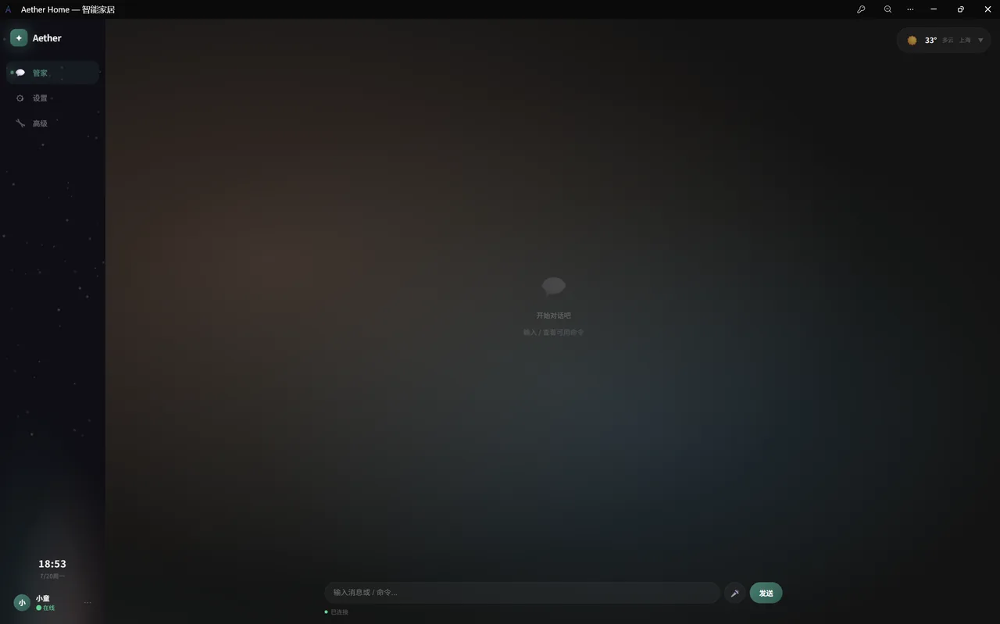
<br/>

</div>

---

## 📸 功能介绍

### 🏠 聊天主页 — 你的 AI 管家

Aether 的核心交互界面。输入自然语言即可控制家中设备——"把客厅灯关掉"、"空调调到 26 度"，AI 会理解你的意图并执行操作。左侧聊天区域支持多轮对话，快捷斜杠命令帮你快速跳转到设备管理、定时任务等功能。

<br/>

<br/>

### ⚙️ 基础设置 — 个性化你的家

配置家庭名称、主人称呼、所在地区等信息。Aether 会根据这些信息提供更贴合你生活的服务。同时可以在这里切换深色/浅色主题，让界面随你喜好变化。

<br/>
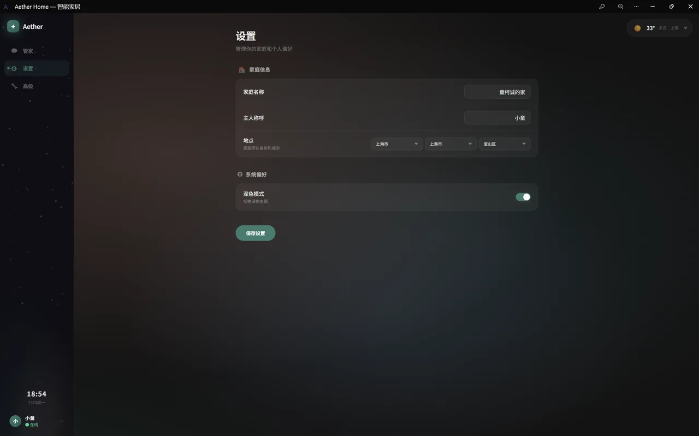
<br/>

### 🔧 高级设置 — 系统级配置中心

集中管理所有底层配置：天气 API 密钥、Exa 搜索引擎、摄像头视觉参数、Home Assistant 连接信息、助手角色设定。每个配置项以卡片形式呈现，点击即可弹出编辑面板。还支持 Emoji 索引重建和文档向量重建。

<br/>
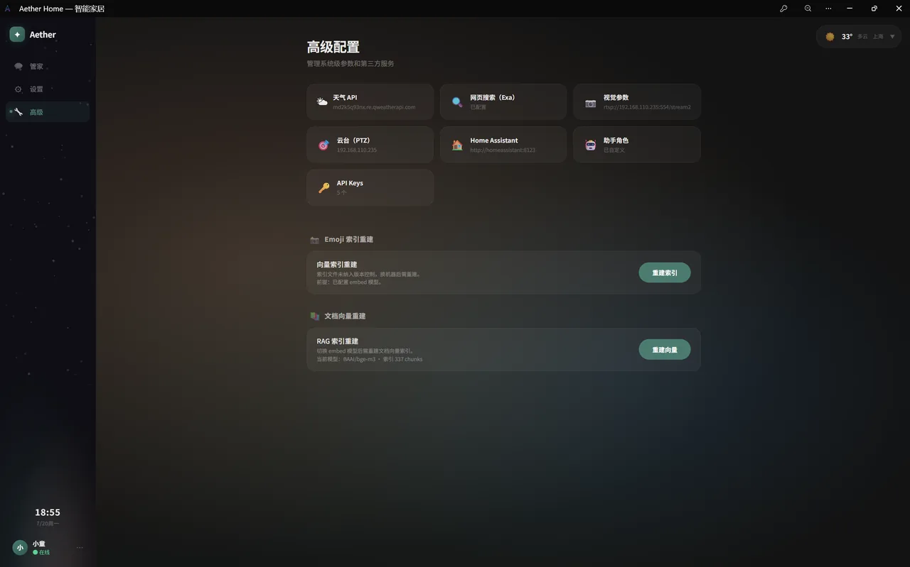
<br/>

### 🤖 模型管理 — 灵活对接各大模型

可视化管理所有 LLM 模型配置。分别设置**对话模型**、**视觉模型**、**嵌入模型**和**摘要模型**，支持切换不同供应商（OpenAI、Claude、DeepSeek 等）。每个账号可独立配置自己的 API Key，互不影响；另有一套**全局 key**（vision/embed 全局共享，chat/summary/stt 可选全局兜底），用二级密码保护，忘记密码可一键重置。

<br/>
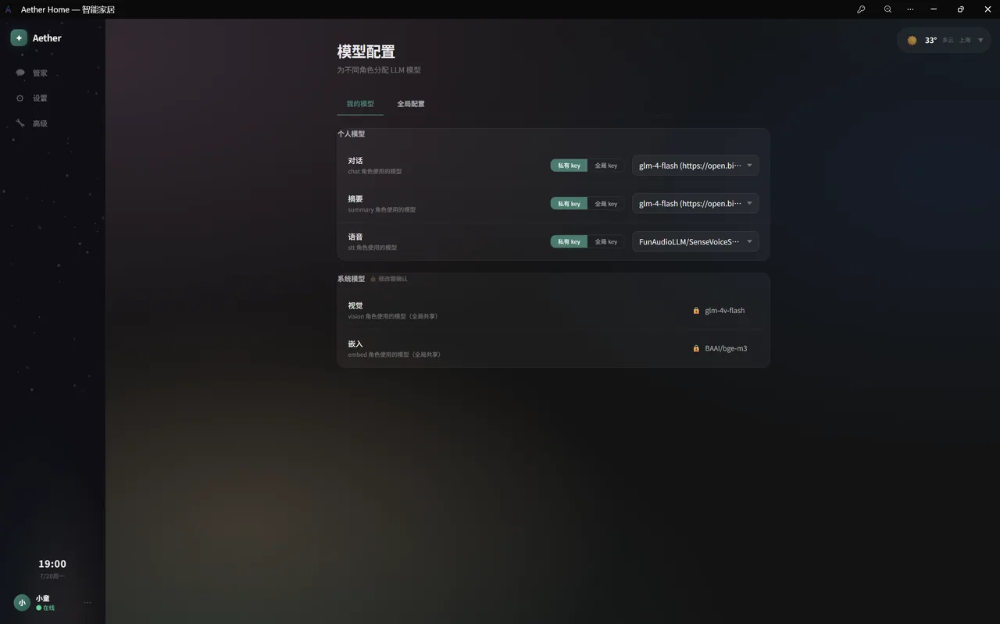
<br/>

### 💡 设备控制 — 一目了明的设备面板

展示所有接入 Home Assistant 的智能设备及其实时状态。灯光的亮度色温、空调的温度模式、窗帘的开关进度——所有状态可视化呈现。也可以直接从面板操控设备，无需打开聊天。

<br/>
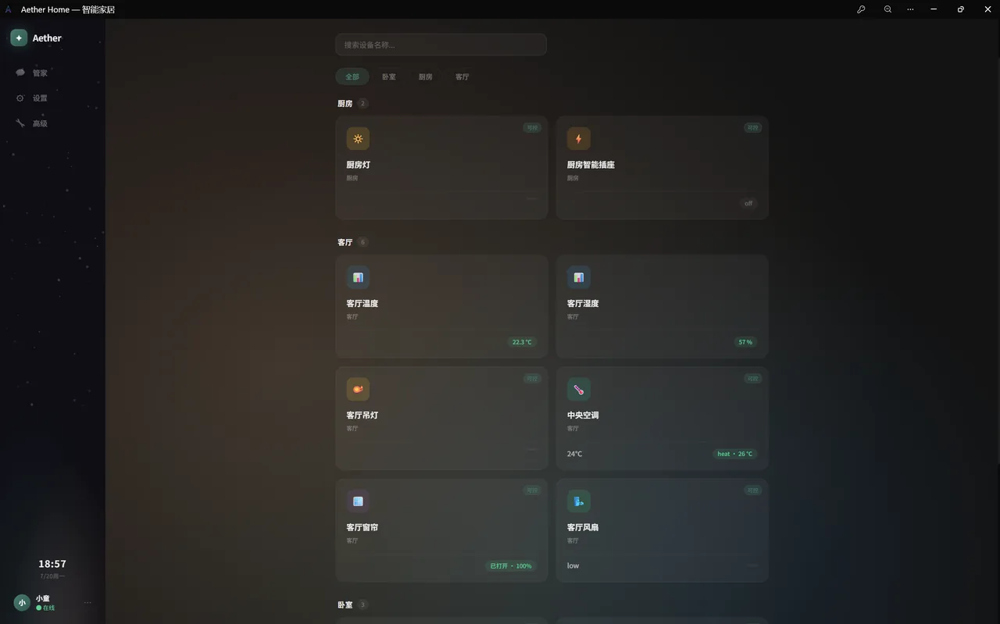
<br/>

### ⏰ 定时任务 — 自然语言创建定时

用自然语言描述你想定时执行的事情，Aether 自动解析并生成 cron 表达式。"每天早上 7 点开窗帘"、"工作日晚上 10 点关掉所有灯"——说一句话就帮你建好定时任务，任务名也会自动生成。

<br/>
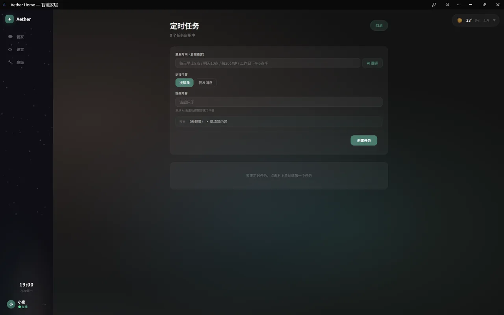
<br/>

### 🔄 自动化规则 — 条件联动，智能决策

创建基于条件的自动化规则：温度高于 30 度自动开空调、检测到运动时打开玄关灯。支持多条件组合和多重动作，让家真正"活"起来。规则纯文本条件评估时按创建者解析对应 LLM Key。

<br/>
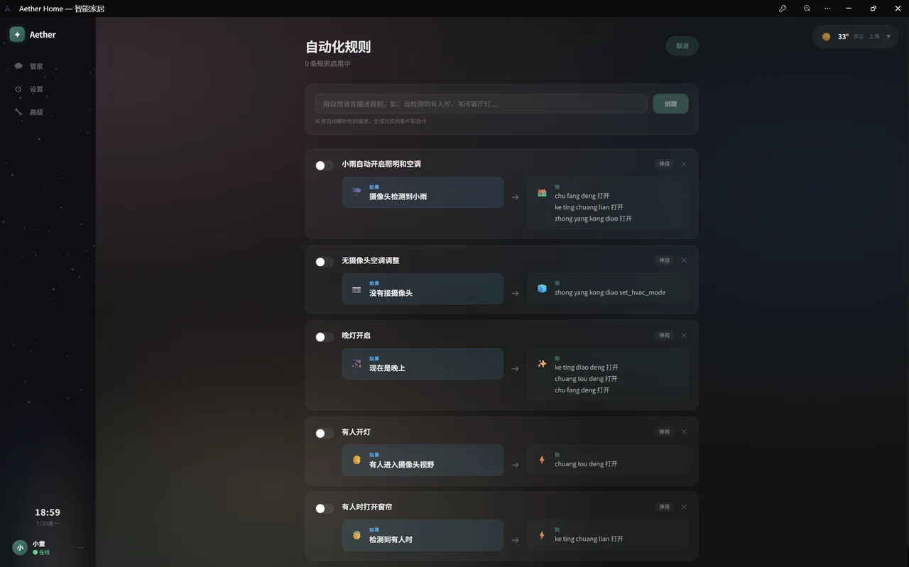
<br/>

### 👁️ 视觉感知 — 让 AI 看懂你的家

接入 RTSP 网络摄像头或 USB 摄像头，AI 实时分析画面内容。支持运动检测自动触发视觉推理，当画面出现异常时主动通知你。可以在聊天中直接询问摄像头"看到了什么"。

<br/>
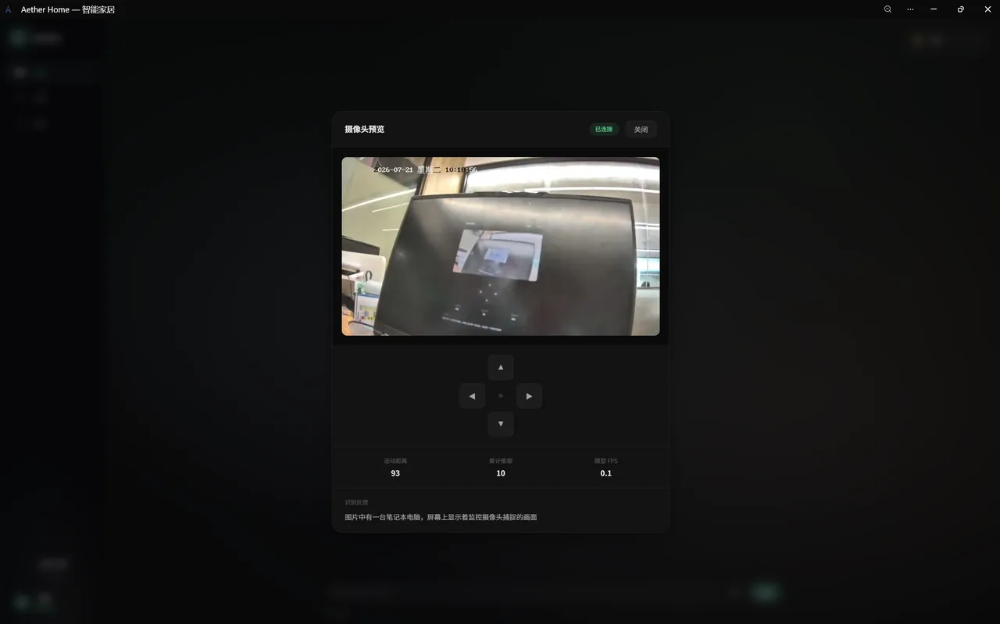
<br/>

### 🎯 关注项配置 — 告诉 AI 你关心什么

自定义视觉系统关注的对象和区域。可以指定特定区域（如门口、窗户）或特定物体（如人、宠物、包裹）。只有关注项出现时才触发通知，避免无意义的频繁报警。

<br/>
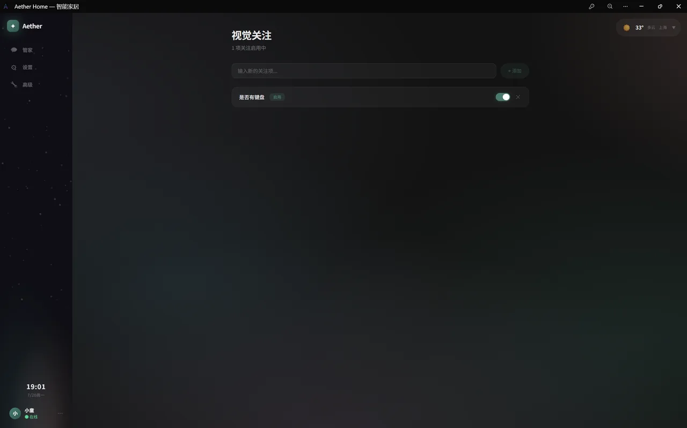
<br/>

### 🧠 语义图谱 — 知识可视化

基于 RAG 技术构建的语义知识图谱。将文档和设备信息向量化后进行实体抽取和关系分析，生成可交互的 3D 图谱。通过 faiss 向量检索快速定位相关信息，支持一键重建索引。

<br/>
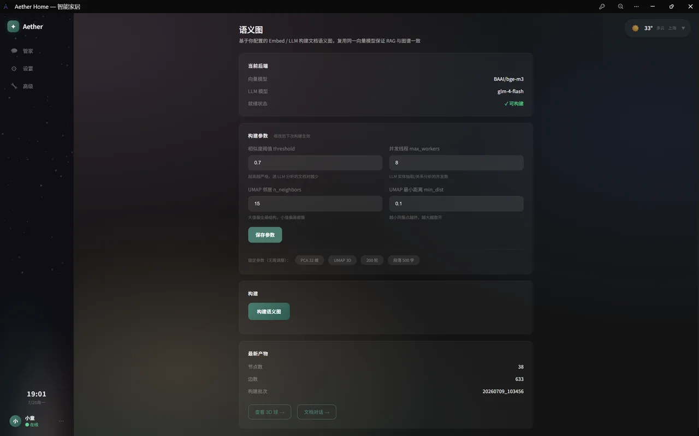
<br/>

### 💬 对话生成效果 — 流式输出的丝滑体验

AI 回复采用流式输出，逐字显示如同真人打字。支持 Markdown 格式渲染，代码块高亮，让对话既智能又美观。设备控制结果以结构化卡片呈现，操作结果一目了然。

<br/>
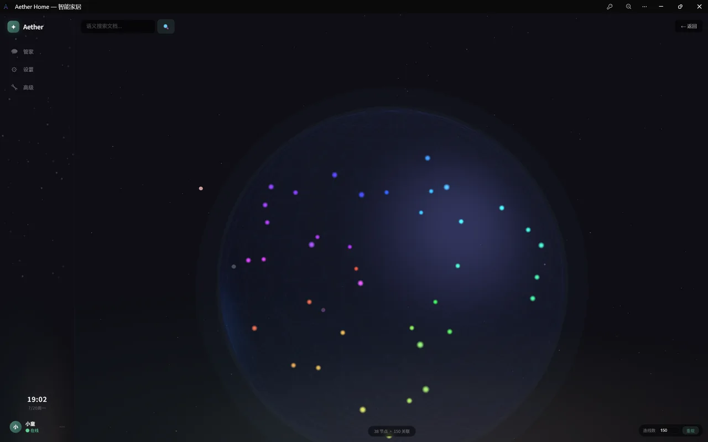
<br/>

---

## 🛠️ 它能做什么

- **🧠 AI 对话控制设备** —— 对接 Home Assistant，自然语言开灯 / 调空调 / 拉窗帘，调用前先走 `verify_action` 只读校验
- **👁️ 摄像头视觉感知** —— RTSP / USB 接入，运动检测触发视觉推理，关注项可配置
- **⏰ 定时任务与自动化规则** —— 自然语言生成 cron 触发时间，任务名自动生成，规则引擎按条件联动设备
- **📊 语义知识图谱（RAG）** —— 文档向量化 + faiss 检索 + 实体共现构图，3D 可视化，embed 模型变更后自动检测 + 一键重建
- **🔌 MCP 工具生态** —— 内置天气 / 网页搜索 / 设备控制工具，可接外部 MCP Server
- **🔐 JWT 鉴权 + 独立配置** —— 登录态走 JWT，LLM Key 独立管理、会话独立，支持一键清空历史会话

## 🏗️ 架构与端口

| 服务 | 端口 | 说明 |
|------|------|------|
| Aether 应用 | `8010` | FastAPI 主服务（REST + WebSocket + 前端 SPA 托管） |
| 启动进度 | `8011` | 冷启动进度上报，供加载页轮询（主端口就绪前可用） |
| Home Assistant | `8123` | 智能家居大脑，Aether 通过其 REST API 控制设备 |
| Mosquitto MQTT | `1884` | 虚拟设备模拟器 → HA 的消息通道 |
| Vite 开发服务器 | `5173` | 仅前端本地开发用，生产环境由 8010 直接托管构建产物 |

```
┌─────────────┐   REST    ┌─────────────────┐   MQTT   ┌───────────┐
│  浏览器 SPA  │ ────────► │  Aether (8010)  │ ◄──────► │  HA (8123)│
│  Vue 3 + Vite│           │  FastAPI+LLM    │          └───────────┘
└─────────────┘           └────────┬────────┘                ▲
                                   │ SQLite / faiss          │ MQTT
                                   ▼                         │
                            ┌──────────────┐         ┌──────────────┐
                            │ app/data,logs│         │ Mosquitto    │
                            └──────────────┘         │  (1884)      │
                                                     └──────────────┘
```

## 🚀 快速开始（Docker，推荐）

一条 `docker compose up` 起全部三个服务。前置准备：

```bash
# 1. 配置密钥
cp .env.example .env
#   编辑 .env，填入 LLM / STT 的 API Key

# 2. 复制配置模板
cp config.example.json config.json
#   ha.token 留空即可，稍后在引导向导里填
```

启动：

```bash
docker compose up -d --build      # 首次或代码更新后加 --build
docker compose ps                 # 四个容器都 Up 即可（aether, aether-ha, mosquitto, aether-simulator）
```

打开 `http://localhost:8010` 进入应用，首次需走引导向导：
1. 家庭信息（名称、主人称呼、地区）
2. LLM 模型配置（对话/视觉/嵌入/摘要，至少配对话模型）
3. Home Assistant 连接 —— 需要先到 `http://localhost:8123` 完成账号注册并创建长期访问令牌

> **HA 首次初始化**（新用户必读）：
> 1. 打开 `http://localhost:8123` → 创建管理员账号（onboarding 流程，会要求填姓名/密码/位置）
> 2. **配置 MQTT 集成**（让模拟器设备能上报到 HA）：
>    ```bash
>    docker exec aether-ha python /config/add_mqtt_config.py
>    docker compose restart homeassistant
>    ```
>    脚本会自动创建指向 mosquitto 容器的 MQTT 集成（broker=`mqtt`、port=`1884`、user=`aether`）。也可在 HA UI 的「设置 → 设备与服务 → 添加集成 → MQTT」手动配置。
> 3. 登录 HA 后左下角头像 → 长期访问令牌 → 创建令牌 → 复制 JWT 粘贴到引导向导第 3 步
>
> 仓库**不包含** HA 的运行时状态文件（onboarding/auth/entity_registry 等），每次 clone 都是干净的 HA，需走完上述 onboarding 才能使用。`ha_config/.storage/core.config` 保留默认地理位置/时区，`ha_config/mqtt/*.yaml` 是模拟器设备声明，由 HA 启动时自动加载。

> **内置演示设备**：仓库自带 11 个虚拟设备（3 灯 / 1 空调 / 1 窗帘 / 1 风扇 / 1 加湿器 / 2 传感器 / 2 插座），声明在 `ha_config/mqtt/*.yaml`，由 `aether-simulator` 容器通过 MQTT 上报状态。目的是让没有真实智能家居设备的用户也能立刻体验完整的 AI 控制流程（聊天开灯、调空调等）。
>
> **接真实 HA 设备时如何处理演示设备**：
> - 方式一（推荐）：在 HA UI「设置 → 设备与服务 → MQTT」里禁用对应实体，或直接删除 `ha_config/mqtt/*.yaml` 后重启 HA 容器
> - 方式二：在 `docker-compose.yml` 注释掉 `simulator` 服务和 `aether` 的 `depends_on: simulator`，再 `docker compose up -d`
> - 方式三：保留演示设备，Aether 会同时看到真实设备和演示设备，聊天时用设备名区分即可

- 应用日志：`docker compose logs -f aether`
- 停止：`docker compose down`（数据保留在 Docker volume 和 `logs/` 挂载目录）

> **摄像头**：默认走 RTSP 网络流（`vision.rtsp_url`），容器无需特殊设备权限，只要摄像头 IP 在容器网络可达。若改用本地 USB 摄像头，需在 `aether` 服务加 `devices: ["/dev/video0:/dev/video0"]`（仅 Linux 主机）。

## 💻 本地开发（不走 Docker）

适合改代码时热重载。后端用 uvicorn，前端用 Vite 开发服务器：

```bash
# 后端依赖
python -m pip install -r requirements.txt

# 前端依赖
cd frontend && npm install

# 前端开发服务器（5173，代理 /api /ws 到 8010）
npm run dev

# 后端（项目根目录，另开终端）
python -m uvicorn app.main:app --host 0.0.0.0 --port 8010

# 前端构建并同步到后端静态目录（生产部署前）
npm run build
```

> 生产部署用 Docker：`docker compose up -d`，然后浏览器访问 `http://localhost:8010`。停止用 `docker compose down`。

## 🌐 从外面远程访问（Tailscale）

Aether 默认只在家里局域网用。想在外面用手机访问，**不要做端口转发暴露公网**，用 Tailscale（基于 WireGuard 的点对点 VPN）更安全——只有你自己 Tailscale 网络里的设备能连进来。

核心做法：

1. 电脑和手机都装 Tailscale，同账号登录，各分到一个 `100.x.x.x` 内网 IP
2. 后端已绑 `0.0.0.0:8010`（监听所有网卡），无需改启动命令
3. 加一条 Windows 防火墙规则，**只放行 Tailscale 网段 `100.64.0.0/10`** 访问 8010：

```powershell
New-NetFirewallRule -DisplayName "Aether Backend 8010 (Tailscale only)" `
  -Direction Inbound -Action Allow -Protocol TCP -LocalPort 8010 `
  -RemoteAddress 100.64.0.0/10 -Profile Any
```

4. 手机浏览器访问 `http://<电脑的Tailscale IP>:8010/`（用 `tailscale ip -4` 查电脑 IP）

> **访问 8010，不是 5173**：5173 是 Vite 开发服务器，只监听 `127.0.0.1`，外部设备连不上。8010 同时托管前端页面和 API，是日常使用和远程访问都该用的端口。

详细步骤、防火墙 profile 踩坑、故障排查见 [`docs/01-安装部署/Tailscale远程访问与防火墙配置.md`](docs/01-安装部署/Tailscale远程访问与防火墙配置.md)。后端 CORS 已预放行 Tailscale `100.64.0.0/10` 网段（`app/main.py` 的 `allow_origin_regex`）。

## ⚙️ 配置文件

| 文件 | 作用 | 是否进版本库 |
|------|------|:---:|
| `.env` | API 密钥（LLM / STT / HA 令牌等），通过环境变量注入 | ✗ |
| `config.json` | 应用运行配置（LLM keys 映射、HA 连接、视觉、天气等） | ✗ |
| `.env.example` / `config.example.json` | 上述两者的模板 | ✓ |

环境变量优先级最高，可覆盖 `config.json`：

| 环境变量 | 覆盖的配置 | 用途 |
|----------|-----------|------|
| `HA_URL` | `ha.url` | 容器内指向 `http://homeassistant:8123` |
| `HA_TOKEN` | `ha.token` | HA 长期访问令牌 |
| `LLM_ENABLED` / `LLM_BASE_URL` / `LLM_MODEL` | `llm.*` | LLM 全局开关与模型 |
| `LOG_LEVEL` | `logging.level` | 日志级别 |
| `STARTUP_PROGRESS_HOST` | — | 启动进度端口绑定地址（容器内设 `0.0.0.0`） |

> LLM 密钥推荐用「高级」页面的 API Keys 卡片管理，会自动写入 `.env` 并持久化到数据库。

## 📁 项目结构

```
app/
├── main.py              # FastAPI 入口：生命周期、中间件、路由注册、SPA 托管
├── bootstrap.py         # 服务初始化（构造所有服务实例）
├── container.py         # DI 容器（AppContainer，消除 from main import 全局）
├── core/                # 配置、数据库、鉴权、限流、异常、链路追踪
├── clients/             # HA / LLM（chat/vision/embed）HTTP 客户端
├── services/            # 业务服务（规则、调度、视觉、天气、会话、RAG、语义图…）
├── agents/              # LangGraph Agent、Dispatcher、Validator
├── mcp/                 # MCP 工具（本地工具、外部 Server、工具执行器）
├── routes/              # REST/WS 路由（按功能分模块）
├── sg/                  # 语义图 pipeline（实体抽取、向量化、关系分析、构图）
├── schema/              # 请求/响应 Schema
└── data/                # SQLite 库、JWT 密钥、emoji 向量索引（运行时生成）
frontend/                # Vue 3 + Vite 前端
ha_config/               # Home Assistant 配置（挂载到 HA 容器 /config；只跟踪配置模板，运行时状态由 HA 生成）
mosquitto/               # Mosquitto MQTT 配置
tests/                   # 后端 pytest（740+ 测试）
frontend/tests/          # 前端 vitest
docs/                    # 用户层 + 技术层文档（按功能分类）
```

## 🧪 测试

```bash
# 后端
pytest                      # 全部
pytest -m "not slow"        # 跳过需要真实 API 调用的慢测试
pytest tests/test_dispatcher.py   # 单个模块

# 前端
cd frontend && npm test
```

CI 通过 GitHub Actions 在每次 push 和 pull request 时自动运行 `pytest -m "not slow"`。

## 📚 文档

详细文档在 `docs/` 下，按功能分类：

- `docs/01-安装部署/` —— 环境准备、Docker 部署、HA 连接、LLM 密钥、天气 API、Tailscale 远程
- `docs/02-AI聊天/` —— 聊天入门、人格自定义、模型角色、会话管理、斜杠命令
- `docs/03-设备控制/` —— 自然语言控制、设备控件、设备面板
- `docs/04-自动化规则/` —— 定时任务、自动化规则、规则维护、视觉触发
- `docs/05-摄像头视觉/` —— 摄像头接入、关注项配置、运动检测
- `docs/06-集成扩展/` —— Exa 搜索、MQTT 接入、外部 MCP
- `docs/07-个性化/` —— Emoji 自定义、家庭信息与主题
- `docs/08-运维排查/` —— API 鉴权、日志排查、健康检查
- `docs/tech/` —— 架构概述、API/MCP 参考、调度/自动化引擎、视觉子系统、配置参考

## 🗺️ 界面导航

侧边栏四个入口，其余功能通过斜杠命令到达：

| 入口 | 说明 |
|------|------|
| **管家** | 聊天主界面，输入 `/` 查看全部斜杠命令（设备、定时、模型等一键跳转） |
| **设置** | 家庭信息、地区、深色模式 |
| **高级** | 系统级配置页面：天气 API、Exa 搜索、视觉参数、HA 连接、助手角色、API Keys（点击卡片弹出 modal 编辑），以及 Emoji 索引重建、文档向量重建 |
| **监控** | 系统监控页面，也可在聊天输入 `/monitor` 跳转 |

---

## 🤝 贡献

欢迎提交 Issue 和 PR。如果你也想出现在贡献者列表里，提个 PR 即可——GitHub 会根据 commit 邮箱自动识别。

---

<div align="center">

**Built with ❤️ by [Aether](https://github.com/tk-fantasy/fantasy)**

</div>
