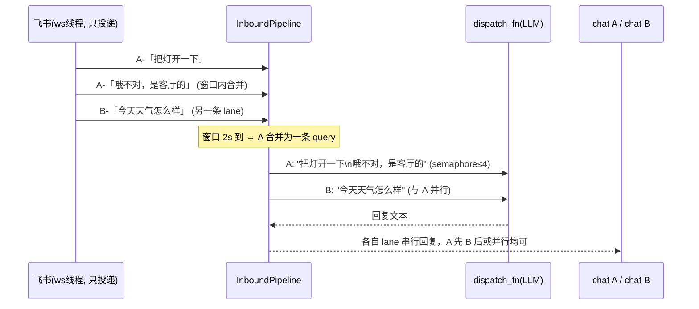

# 飞书多人对话：通用入站缓冲管道设计

日期：2026-09-09
状态：已批准（通用管道组件 / 飞书第一个接入方）

## 背景与现状

飞书是宿主侧集成（`integrations/feishu/`，`_start_host_integrations` 扫描
`main.py` 的 `start(dispatch_fn, loop)` 加载）：ws 线程收到消息事件后
`run_coroutine_threadsafe` 把 `_handle_and_reply` 投给主 loop，
fire-and-forget——**每条消息一个独立 task**，互相之间没有任何协调。

这套"零协调"模型在单人低频私聊下没问题，但多人/群聊 @机器人 场景有五个结构性问题：

1. **无保序**：同一用户连发"把灯开一下"→"哦不对，是客厅的"→ 两个 task 并发跑，
   后发的可能先处理，第二条修正失去上下文。
2. **无合并**：用户习惯性连发几条短句，被拆成多轮独立 LLM 调用——贵、慢、上下文碎。
3. **无并发上限**：群里多人同时 @，N 个 LLM 调用同时打出，与网页端用户共享
   per-user key 配额，无任何节流。
4. **无超时反馈**：LLM 卡住时用户干等到飞书侧超时，没有任何中间反馈。
5. **重推放大风险**：ws 线程绝不能阻塞（历史事故：阻塞→心跳停→飞书断连→
   重推未确认消息→重复回复，见 `ws_client._on_message_receive` 注释）。
   现在靠"立即 fire-and-forget"保心跳；若未来任何改动让处理变慢，重推消息
   没有去重防线。

## 需求

- 同一会话（chat）消息**串行保序**处理；不同会话并行。
- 短时间连发的多条消息合并为一轮处理。
- 全局并发上限 + 单轮超时保护 + 中间反馈。
- **解耦**：做成宿主通用入站管道组件，飞书只是第一个使用者；未来 Telegram/
  微信等集成直接复用。管道不认识"飞书"，飞书不自己实现排队。

## 非目标

- 不做消息持久化队列：内存队列，进程重启丢失可接受——飞书侧未确认的消息会被
  重推，天然补偿（配合去重表防重复）。
- 不做跨会话优先级/公平调度：全局 semaphore 先进先出即可。
- **不改网页 WS**（`ws_routes._chat_loop`）：网页是"打断式"交互（新消息自动
  cancel 旧任务 + interrupt 停播），排队反而违背体验；飞书是消息形态，天然"排队式"。

## 设计：`app/integration/inbound_pipeline.py`（宿主通用组件）

```python
class InboundPipeline:
    def __init__(self, handler: Callable[[str, str, str], Awaitable[str]],
                 *, merge_window: float = 2.0, max_concurrency: int = 4,
                 lane_queue_size: int = 8, handler_timeout: float = 120.0,
                 processing_hint_after: float = 15.0): ...
    async def submit(self, chat_key: str, query: str,
                     meta: dict | None = None) -> None: ...
    async def stop(self) -> None: ...
```

`handler` 即宿主现有 dispatch 适配函数（`_build_dispatch_fn` 的
`_dispatch(query, session_id, user_id) -> str`），管道对它零感知。

### 会话车道（lane）：同 chat 串行 + 合并窗口

- `dict[chat_key, _ChatLane]`；lane 持 `asyncio.Queue(maxsize=lane_queue_size)` +
  一个 worker task（首条消息懒创建；空闲 `stop` 时回收）。
- worker 消费到首条消息时启动**固定合并窗口**（自首条起算 `merge_window` 秒，
  不顺延——避免用户持续打字导致无限推迟）；窗口期间到达的消息全部 append 进
  buffer，窗口结束把 buffer 以 `"\n".join` 拼成**一个** query 处理。
- 同一 lane 内严格串行：上一轮处理完才消费下一批 → 天然保序。

### 全局并发上限与超时

- 处理阶段包一层全局 `asyncio.Semaphore(max_concurrency)`：并发的是"不同 lane
  的处理轮"，不是消息数。
- 单轮处理 `asyncio.wait_for(handler_timeout)`：超时向该 chat 回复
  "这条消息处理超时了，请稍后重试或拆成几条发送"；handler 的 task 取消，
  lane 继续服务下一条。
- `processing_hint_after` 秒未完成时，先向该 chat 发一条"还在思考中，请稍等…"
  （默认 15s；配置为 0 关闭），避免长任务期间用户干等或重发。

### 背压与错误隔离

- lane 队列满（`lane_queue_size`，默认 8）：丢最旧一条并给该 chat 发提示
  "消息积压较多，最早一条被跳过了"——保新弃旧，宁可少答不串答。
- 单条处理异常：try/except 在 lane worker 内消化，回复固定错误文案；不影响
  本 lane 后续消息，更不影响其他 lane。

### 生命周期

- 飞书 `main.start()` 构造、`stop()` 里 `await pipeline.stop()`（收尾所有 lane，
  取消 worker）。热重连（管理页改凭证 → stop+start）自然重建，队列清空可接受。

## 飞书接入（改动最小化，宿主零改动）

`ws_client.py` 仅两处变化：

1. `start()` 构造 `self._pipeline = InboundPipeline(self._dispatch_and_reply, ...)`，
   handler 内部就是原有的 `_handle_and_reply` 换成"拿文本调 dispatch_fn →
   `_send_message(chat_id, reply)`"。
2. `_on_message_receive`（ws 线程）把
   `run_coroutine_threadsafe(self._handle_and_reply(...), self._loop)`
   改为 `run_coroutine_threadsafe(self._pipeline.submit(chat_id, query, {...}), self._loop)`
   ——**ws 线程仍然只做一次投递立即返回**，心跳约束不变。

宿主侧集成约定（`start(dispatch_fn, loop)` 签名、`meta.py`、管理页显示）不动；
管道由飞书 `main.py` 自建（`from app.integration.inbound_pipeline import
InboundPipeline`），不改变宿主加载协议。

斜杠命令（`/clear`、`/help`）不进管道：仍是 `_handle_and_reply` 内直达路径，
即时响应、不受合并窗口延迟——排队只针对要走 LLM 的普通消息。

### 事件去重（飞书侧职责，不进通用管道）

飞书断连重推未确认消息属协议细节，在 `ws_client` 内加短期去重表：
`dict[event_id, expiry]`（TTL 5 分钟，懒清理），重复 `event_id` 直接丢弃。
管道/宿主不感知——保住"管道通用"的边界。



## 配置项

| 配置（`integration.feishu.*`） | 默认 | 说明 |
|---|---|---|
| `merge_window_seconds` | 2.0 | 合并窗口时长（自首条起算，不顺延） |
| `max_concurrency` | 4 | 全局同时处理的 lane 数上限 |
| `lane_queue_size` | 8 | 每 lane 待处理上限，满丢最旧并提示 |
| `handler_timeout` | 120 | 单轮处理超时（秒） |
| `processing_hint_after` | 15 | 超过此时长发"处理中"提示（0 关闭） |

## 测试

- 单元（管道，纯 asyncio、不 mock 飞书）：
  - 合并：窗口内 3 条并 1 条、`"\n".join` 顺序、窗口不顺延（持续到达只合并首批后继续）。
  - 保序：同 lane 两条，第一条 handler 阻塞时第二条必等待。
  - 并发上限：3 个 lane、max_concurrency=2，任意时刻在处理数 ≤2。
  - 超时：handler 挂起 > timeout → 超时文案、lane 存活、后续消息正常。
  - 队列满：丢最旧 + 提示回调被调。
  - 异常隔离：handler 抛错不影响本 lane 下一轮与其他 lane。
  - stop：取消所有 worker，不泄漏 task。
- 飞书侧：`_on_message_receive` 仍只投递（断言 ws 线程无 await LLM）、
  去重表命中丢弃、`/clear` `/help` 斜杠命令走原有直达路径（不进管道排队）。
- 回归：现有飞书测试 + `_start_host_integrations` 加载不受影响。

## 实施分期

单期交付：管道组件 + 飞书接入 + 去重表（彼此咬合，不宜拆分）；
配置项全部带默认值，零配置可用。
