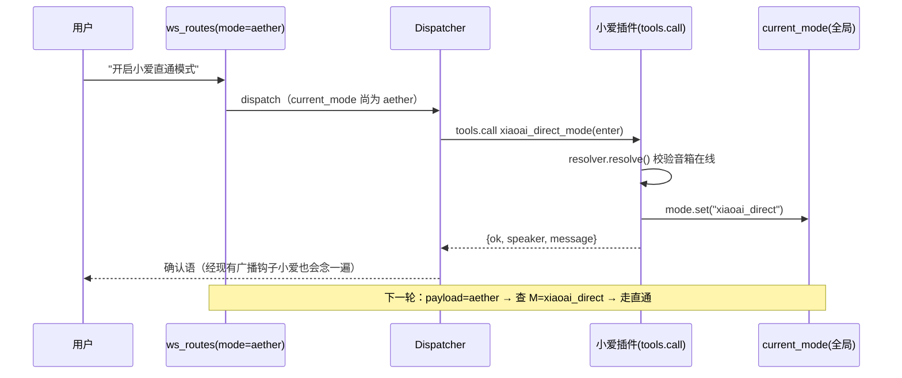
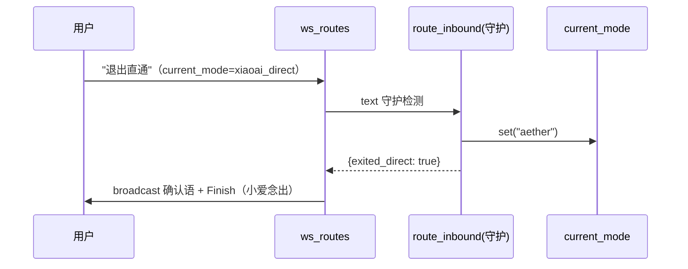

# 小爱直通模式：插件注入 agent 工具 + 关键词退出 + 自动化任务工具

日期：2026-09-09
状态：已批准（两段式确认 / 直通全局作用域 / 任务工具宿主内置）

## 背景与现状

1. **直通模式是纯手动切换**：前端顶栏（XiaoAiPanel，经 UI 贡献机制 `action=set_mode`）
   写全局配置 `integration.current_mode`；`ws_routes._chat_loop` 按 **payload.mode**
   分流——`"aether"` 进 LLM dispatcher，其他值经 `IntegrationLayer.route_inbound` 转给
   第一个声明 `inbound_router` 的插件（小爱 `XiaoAiRouter` →
   `execute_text_directive` 原生执行，不进 LLM）。没有"用户说一句话就进入/退出直通"
   的语音链路：进直通后没有 LLM 可判意，普通模式下也没有工具能切模式。
2. **插件无法给 agent 注入工具**：agent 工具只来自 `app/tools.py` 内置注册
   （`register_all_tools`）和外部 MCP server，经 `convert_all_tools` →
   `build_chat_agent` → `dispatcher.set_agent` 装配。插件平台的
   `CapabilityType` 只有 `output_sink` / `inbound_router` / `model_adapter`，
   小爱插件空有 `XiaoAiResolver` / `XiaoAiSink` 能力，却不能以工具形式暴露给 LLM。
3. **定时任务已有对话工具，自动化规则没有**：`scheduled_task_create/list/delete`
   已让 agent 能对话建定时任务；自动化规则（`rule_service.build_rule` 解析自然语言 →
   规则 JSON → `rule_registry` 落库 → `automation_service` 周期评估执行）目前只能走
   网页自动化页（REST），LLM 无法对话创建/触发。

## 需求

- 小爱插件加入（启动/启用）时，把它的小爱专属能力作为工具注入 agent——机制通用，
  不硬编码插件名。
- 普通模式下用户说"开启小爱直通模式"类的话 → LLM 判意调工具进入直通；
  直通中用户说退出类关键词 → 不经 LLM 直接退出（直通本来就是零 LLM 路径）。
- 工具不仅能加定时任务，也能创建/触发自动化任务；创建类操作先返回
  **待确认 JSON** 给用户评估，用户确认后才真正落库（两段式）。
- 解耦：模式状态机、任务工具都在宿主通用层；小爱插件只提供小爱专属工具与路由。

## 非目标

- 不做按会话/按用户的直通状态（`current_mode` 维持全局单值，语义见下）。
- 不改定时任务工具（`scheduled_task_*`）的"直接创建"语义（理由见
  「为什么只有自动化规则要两段式」）。
- 不做前端强制改造（顶栏状态依赖现有 `state_key=current_mode` 机制）。

## 总体架构与解耦边界

```
┌─ 宿主进程 ──────────────────────────────────────────────┐
│ ws_routes ──mode解析(新增:回退查current_mode)──┐         │
│                                              ↓         │
│                        aether → Dispatcher(LLM+工具)    │
│                             ↑ 工具装配                   │
│   app/tools.py 内置(含新增 automation_rule_*)           │
│   + 插件注入工具(新增 agent_tools 能力, MCPTool 包装)     │
│                             │                           │
│                        非aether → route_inbound(入口加   │
│                             │      退出关键词守护)        │
│  config_helper.current_mode ←──── 全局单一事实源         │
└──────────────┬───────────────────────────────┬──────────┘
        方向1 RPC(tools.list/tools.call)   方向2 RPC(mode.set)
               ↓                               ↓
┌─ 小爱插件进程 ──────────────────────────────────────────┐
│ tools: xiaoai_direct_mode(enter/exit/status)            │
│ router: XiaoAiRouter(不变)  sink: XiaoAiSink(不变)       │
└─────────────────────────────────────────────────────────┘
```

三条解耦原则：

1. **机制与内容分离**：`agent_tools` 是通用插件能力（RPC 协议 + SDK + 宿主装配），
   谁声明谁注入；小爱插件只贡献"小爱专属"工具（直通开关），定时/自动化任务工具是
   宿主内置核心能力，**不放进任何插件**——网页、飞书、小爱所有渠道共享同一套工具。
2. **模式单一事实源在宿主**：`integration.current_mode` 仍是唯一模式状态；插件经新增
   反向 RPC `mode.set` 请求切换，自己不保存状态。前端手动切换（`set_mode` action）与
   LLM 工具切换写同一个值，天然一致。
3. **直通守护是框架层**：退出关键词检测放在 `route_inbound` 入口（宿主），任何
   `inbound_router` 插件（未来其他语音入口）都自动获得退出通道，插件自己不用实现。

## 设计一：通用 `agent_tools` 插件能力

### schema / 协议

- `app/integration/schema.py`：`CapabilityType` 新增 `AGENT_TOOLS = "agent_tools"`；
  加入 `PROCESS_CAPABILITIES`（子进程插件承载）。
- `rpc_protocol.py` 方向 1（宿主→插件，偶数 id）新增：
  - `METHOD_TOOLS_LIST = "tools.list"`：宿主拉工具定义。返回
    `{"tools": [{"name", "description", "parameters"(JSON Schema)}]}`。
  - `METHOD_TOOLS_CALL = "tools.call"`：宿主调工具。params
    `{"name": str, "arguments": dict, "context": {"user_id": str, "query": str}}`
    （只传精简上下文，不传会话历史）。返回工具结果 dict（约定同现有工具：
    `{"error": ...}` 为失败，可带 `hint`/`candidates`）。
- `plugin_base.py`：`_METHOD_CAPABILITY` 增加两项 → `"agent_tools"`（沿用现有弱强制：
  未声明该 capability 的插件收到这两方法直接拒绝，防越权）。

### SDK

`IntegrationPlugin` 新增：

```python
@dataclass
class ToolDefinition:
    name: str
    description: str
    parameters: dict            # JSON Schema
    handler: Callable[[dict, dict], Awaitable[dict]]   # (arguments, context) -> dict

# IntegrationPlugin:
self.tools: list[ToolDefinition] = []   # 子类 setup() 里构建
```

基类 `handle()` 增加分发：`tools.list` 返回除 handler 外的定义；`tools.call` 按
name 找到定义调 `handler(arguments, context)`，name 不存在返回
`{"error": "unknown tool: ..."}`。

### 宿主装配（main.py + mcp_client_manager）

- `MCPClientManager` 新增 `unregister_client(client_id)`（按 client_id 批量移除，
  插件停止时清场用）。
- 装配流程（lifespan 中 `integration_layer.start()` 之后执行；插件运行时
  `start_plugin` / `restart_subprocess_plugin` 成功后同样触发）：
  1. 找出 manifest 声明 `agent_tools` 且存活的插件，RPC `tools.list` 拉定义
     （超时 10s；失败记警告跳过——插件工具缺位不阻塞宿主启动）。
  2. 每个定义包装为 `MCPTool(client_id=<plugin_id>, tool_name=<name>, ...,
     handler=RPC代理)`，工具全名即 `xiaoai___xiaoai_direct_mode`（沿用现有
     `client_id___tool_name` 约定）。RPC 代理 = `await proc.call(METHOD_TOOLS_CALL,
     {...})`；插件进程不可达/超时返回 `tool_error("小爱插件未响应…")`（supervisor
     有崩溃重启，重试回路由 dispatcher 现有失败重试承担）。
  3. 注册进 `mcp_client_manager` 后调现有 `_rebuild_agent()`（复用
     `convert_all_tools` → `_json_schema_to_args_schema` → `build_chat_agent`
     全链路，error/hint/candidates 渲染白得）。
- 插件停止（`stop_plugin`）时：`unregister_client(plugin_id)` + `_rebuild_agent()`。
- **解耦注入方式**：IntegrationLayer 不 import 任何工具模块，只暴露回调
  `on_plugin_tools_changed: Callable | None`，由 main.py 注入"重拉工具+重建 agent"
  的实现；启停钩子处触发。平台层不认识"工具"，只认识"有东西变了"。

### 小爱插件注入的工具（唯一一个，机制验证即够）

```python
# plugin.py setup() 末尾
self.tools = [ToolDefinition(
    name="xiaoai_direct_mode",
    description=(
        "【小爱直通模式开关】用户想\"开启小爱直通模式/把说话交给小爱原生执行\"时传"
        "action=enter；想\"退出直通/回到智能助手\"时传 action=exit（普通模式下说退出"
        "也调本工具兜底）；action=status 查询当前模式。进入前会校验小爱音箱在线。"
    ),
    parameters={"type": "object", "properties": {
        "action": {"type": "string", "enum": ["enter", "exit", "status"]}},
        "required": ["action"]},
    handler=self._handle_direct_mode,
)]
```

handler 走新增方向 2 反向 RPC `mode.set` / `mode.get`：

- `rpc_protocol`：`METHOD_HOST_MODE_SET = "mode.set"`、`METHOD_HOST_MODE_GET = "mode.get"`；
  `HostProxy` 新增 `host.mode.set(mode)` / `host.mode.get()`。
- `integration_layer._register_host_methods` 注册 handler（闭包调
  `set_current_mode` / `get_current_mode`），`required_permission="mode"`；
  小爱 manifest `permissions` 增加 `"mode"`。
- `enter` 前置校验：先 `resolver.resolve()` 确认音箱在线——离线/解析失败返回
  `{"error": ..., "hint": "音箱不可用时不进入直通，避免用户说话无人应答"}`，
  **不切换模式**。成功后 `host.mode.set("xiaoai_direct")`，返回：

```json
{"ok": true, "mode": "xiaoai_direct", "speaker": "xiaomi_cn_xxx_lx06",
 "message": "已进入小爱直通模式，后续话将由小爱直接执行；说「退出直通」可返回智能助手"}
```

`exit` 幂等（已在 aether 也返回 ok）；`status` 返回当前 mode + 已解析音箱信息。

## 设计二：直通模式的路由与退出

### 模式解析：宿主 current_mode 成为路由事实源（关键改动）

现状 `ws_routes._chat_loop` 只看 `payload.mode`，前端不感知 LLM 切模式，下一轮仍发
`"aether"` 会绕过直通。改为：

```python
mode = payload.get("mode") or "aether"
if mode == "aether":
    mode = get_current_mode() or "aether"   # 非默认时回退查全局状态
```

- 前端显式传非 aether → 照旧直通（UI 手动路径不变）。
- 前端传 aether（默认值）→ 以宿主 `current_mode` 为准 → LLM 工具切的模式立即生效，
  前端零改造。顶栏状态条经现有 `state_key=current_mode` 读取机制同步。

### 进入链路（时序）



### 退出关键词守护（直通中，零 LLM）

`IntegrationLayer.route_inbound` 入口新增守护（框架层，通用）：

- 词表：config `integration.direct_exit_keywords`，默认
  `["退出直通", "退出小爱", "结束直通", "关闭直通", "退出语音直通", "回到智能助手"]`。
- 匹配规则：**仅当 `len(text.strip()) <= 16` 且包含任一关键词**才退出——短句限定
  避免"把'退出直通模式'这句话翻译成英文"这类长句误伤（长句照常直通给小爱）。
- 命中：`set_current_mode("aether")`，返回
  `{"ok": True, "exited_direct": True, "message": "已退出直通模式"}`，**不**转发插件。
- `ws_routes._handle_direct`：收到 `exited_direct` 时调
  `sink_manager.broadcast("好的，已退出直通模式，继续说吧")`（复用现有广播钩子，
  小爱有声确认）并给前端发 `Finish(success=True, message=...)`。



### 边界情况

- **直通中音箱离线**：`route` 失败把 error 透给前端（现有行为），不自动退模式
  （避免用户修音箱期间被踢回）；前端顶栏手动切回 + `exit` 工具兜底双通道仍在。
- **多台音箱**：`enter` 前置 `resolve()` 抛"多台候选"错误，提示去管理页配置后重试，
  同现有 resolver 语义。
- **普通模式下说"退出直通"**：LLM 调 `action=exit`（幂等），无害。

## 设计三：自动化任务工具（宿主内置）+ 两段式确认

### 新增工具（app/tools.py `_register_automation_rule_tools`；ToolDeps 增加 rule_service / automation_service 引用，沿用 ref 模式支持热替换）

| 工具 | 作用 | 返回 |
|---|---|---|
| `automation_rule_create` | `rule_service.build_rule(text, user_id)` 解析自然语言→规则 JSON（内置设备校验+重试），**不落库**，写 pending 缓存 | `{"status":"pending_confirm","pending_id","rule":{...},"summary","expire_minutes":10}` |
| `automation_rule_revise` | `rule_service.revise_rule(pending.rule, instruction)` 按用户反馈改 pending | 同上（新 pending JSON） |
| `automation_rule_confirm` | pending 校验（存在/未过期）→ 轻量重校验 actions 实体存在 → `rule_registry` 落库（带 user_id） | `{"success":true,"rule_id","name","summary"}` |
| `automation_rule_trigger` | 取规则 → `automation_service.trigger_rule(rule_id)` **跳过条件直接执行动作**（用户说"触发"就是要执行；虚拟摄像头演练 dry_run 门控保留） | `{"success","executed":[...]}` |
| `automation_rule_list` | registry 列表（id/name/type/condition 摘要/enabled） | `{"rules":[...],"count"}` |
| `automation_rule_delete` | 删 registry | `{"success","rule_id"}` |

`automation_service` 新增 `trigger_rule(rule_id)`：直接 `_run_actions`（冷却/门控是
"自动评估"的概念，手动触发不受限），动作经现有 `_execute_action` → `tool_executor`
全链路（失败处理/留痕/演练模式白得），并 `alert_service.record` 留痕。

### 两段式确认状态机

- **存储**：session 新字段 `pending_confirmations: dict[pending_id, {"kind":
  "automation_rule", "rule": dict, "created_at": float}]`，随 `session_store` 现有
  持久化走；**懒过期**——读取时 `created_at + 600s` 判过期，过期即删并返回
  `tool_error("待确认规则已过期", hint="请重新描述需求，我会重新生成")`。
- **pending_id**：`uuid4().hex[:12]`，同 session 可并存多个，LLM 用最近一个。
- **评估交互**：create 返回的 JSON 由 LLM 转述为中文要点（条件/动作/设备/冷却）
  并明确问"确认创建吗？可以说『确认』或直接说要改哪里"。用户"确认"→ confirm；
  "改成…"→ revise；其他话题→ pending 自然过期，不阻塞对话。
- **错误约定**：全部沿用 `tool_error(reason, hint, candidates)`（错误即提示词），
  失败自动进 dispatcher 失败重试回路。

### 为什么只有自动化规则要两段式（定时任务保持直接创建）

定时任务的 schedule/payload 结构化程度高、执行一次、误建易删；自动化规则是 LLM
自由解析设备与条件（`build_rule` 的解析空间大），且落库后**每 30 秒被评估一次、
条件成立就真执行设备动作**——错误的规则是持续性风险。误建成本不对称，所以规则
创建加确认环节，定时任务维持现状（改动会破坏既有提示词与测试的稳定语义）。

## 错误处理汇总

| 场景 | 行为 |
|---|---|
| 插件进程死/超时（tools.call） | handler 代理返回 `tool_error` → 失败重试回路（supervisor 同时拉起插件） |
| 音箱离线时 enter | 前置 resolve 失败，报错不进模式 |
| 退出词长句误伤 | ≤16 字限定，长句不检测 |
| confirm 时 pending 过期/不存在 | `tool_error` + hint 引导重建 |
| confirm 时 actions 实体已失效 | 轻量重校验失败即拒，hint 指向 revise |
| 插件 tools.list 失败 | 警告跳过，宿主正常启动（工具缺位可见于日志） |

## 测试

- 单元（新增）：
  - plugin_base：`tools.list` / `tools.call` 分发；未声明 `agent_tools` capability 被拒。
  - 宿主装配：注册→rebuild 触发；`stop_plugin` 注销→rebuild；tools.list 失败跳过。
  - route_inbound 守护：命中短句退出 / ≤16 字边界 / 词表可配 / 长句放行。
  - ws_routes mode 解析：payload=aether + current_mode=xiaoai_direct → 直通；
    payload 显式非 aether → 直通；current_mode=aether → dispatcher。
  - `xiaoai_direct_mode`：enter 前置 resolve 失败不切模式 / exit 幂等 / status。
  - automation 工具：create 写 pending / confirm 落库带 user_id / 过期拒绝 /
    revise 更新 pending / trigger 直执行（dry_run 生效）/ list/delete。
- 回归：`tests/integrations/`（小爱插件现有行为不变）、`scheduled_task_*`、
  rule REST 路由、dispatcher 失败重试。

## 实施分期

- **Phase 1（本设计主体）**：`agent_tools` 能力（schema/rpc/sdk/装配/注销）+
  `mode.set`/`mode.get` 反向 RPC + 小爱 `xiaoai_direct_mode` 工具 +
  route_inbound 退出守护 + ws_routes 模式解析改造。
- **Phase 2（独立可交付）**：`automation_rule_*` 六个工具 + session pending 确认
  状态机 + `automation_service.trigger_rule`。
